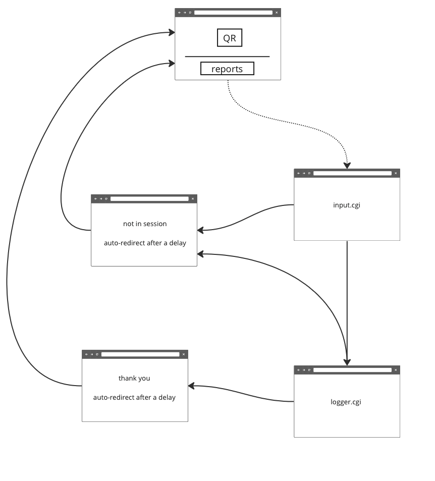

# Classroom Participation, Feedback, and Response System

A simple system to allow students to provided feedback about a lecture/lab. Each student can provide feedback:

  1. To indicated that the student participated in the class.
  1. To assign a simple rating (0..10) to indicated the value[^1] of the lecture/lab.
  1. To provide impromptu feedback about the class, or 
     To respond to a simple prompt provided by the instructor.

[^1] Yes, "value" will mean different things to different people. We intentionally leave it up to the student to define it as they see fit.

This system is designed to as frictionless as possible to encourage student participation. Additionally, the system is designed to be transparent. All feedback, in summary form, is subsequently shared with all class members.

### Classroom Workflow
  1. The Professor projects the ``index.html`` page onto to the screen
     - A QR code for the current class in session is presented
     - The Professor may enter a prompt and the number of attendees
  1. Students take a picture of a QR code
     - said QR code is only valid during a finite time-window
  1. Students fill out a web form with the following information
     - an email address (some personal identifier)
     - rating of the class (low=0 .. high=10)
     - text response (possible to a specific prompt)
  1. Students may visit the ``index.html`` page to obtain a summary report

     

#### Possible Upgrades:
  * Student Authentication 
    - to allow caching of email address
    - to limit feedback to just registered students

#### Status: 
  * A prototype system, built quickly, using CGI using the bash shell.
  * We anticipate the design of the system will change with our initial usage.
  * A student programming project could be to rewrite the application in an appropriate MVC (Model View Control) Framework.

#### Gaming the System

The system is designed to allow students who attended the class to provide feedback.  If the feedback collected is used as part of the grading system (e.g., mandatory attendance), students who did not attend a class might attempt to provide feedback anyways to obtain credit.

Tighter controls could be placed on the process to collect feedback.  But there are downsides to this approach.  

  1. Students will continue to find ways to circumvent these controls.
  1. Students, not in attendance, will skew the information you are seeking.
  1. Students, in attendance, will provide less candid feedback.

In short, we specifically designed the system with a reduce set of controls.  Sure, we might received some bogus feedback, but we believe such feedback will equate to some noise in the data.  The implemented controls are as follows:

  1. A unique QR code (with an embedded security code) is generated for each class period.
     - This prevents individuals from using a previous QR code for a future class.
     - Note that we use the same QR for all classes in our prototype system.
 
  1. The feedback can only be submitted during a defined time-window, for example during the last 15 minutes of the class.

  1. Students must provide email addresses when submitting feedback.
     - the email address can be checked to ensure the submitted is a student in the class.
     - the email address can be used to ensure only a single submission per student.
     - the email address encourages the student to be more responsible and considered with their feedback.

---
### Web Pages
1. Primary page:
   * URL:  participation/index.cgi
   * Purposes: 
     - To generate a QR code for students to access the system
     - To set a prompt or to record the number of attendees
     - To display a summary of current's week feedback  
       (May trigger backend process to process log files)

1. Input Page
   * URL: participation/input.cgi
   * Purposes: 
     - To validate a class is in session
     - To gather information from student
     - To post the information to the logger page

1. Logger Page
   * URL: participation/logger.cgi
   * Purposes:
     - To validate a class is in session
     - To log the information for later processing
     - To redirect the user to the "Thank you page"

1. Not-In-Session and Thank-You Page
   * URLs:
     - participation/not-in-session.html
     - participation/thank-you.html
   * Purpose:
     - To provide feedback to the student about their submission

### HTTP Header Values:

The following HTTP Headers are defined

  1. x-participation-date
     - The date/time in which the request was made
     - Example: x-participation-date: Fri Oct 21 13:21:50 PDT 2022
  1. x-participation-info: 
     - Information about class in session
     - Examples:
       - No class in session
       - COMP122 MW 9:00

### Non-Web related Files

The following is the current location of various files:

  * participation/:  root of the repository
    * class_info:
      - a cron-like file to determine a validate time-window for each class 
    * logs/: raw data that has been logged
      - 2022-10-13:COMP122-Thursday-2:00
        * log file for Thursday's 2:00 session of COMP122 on 10/13/2022
    * reports/: processed log files
      - 2022-10-13:COMP122-Thursday-2:00.env
        * a bash env file for Thursday's 2:00 session of COMP122 on 10/13/2022
    * .htaccess: 
      - to be defined to limit access to current students

### Planned Installation

The currently, all the files are placed into the public_html file hierarchy.  In the future the following the primary directory within the public_html directory should have symbolic links to the equivalent files stored within the non-web accessible directory.

  * public_html
    * participation
      * .htaccess -> \~/apps/participation/public/.htaccess
      * index.cgi -> \~/apps/participation/public/index.html
      * \*.html  -> \~/apps/participation/public/\*.html
      * \*.cgi    -> \~/apps/participation/public/\*.cgi
      * reports   -> \~/apps/participation/public/reports

  * apps
    * participation
      * public
        * reports
      * logs

